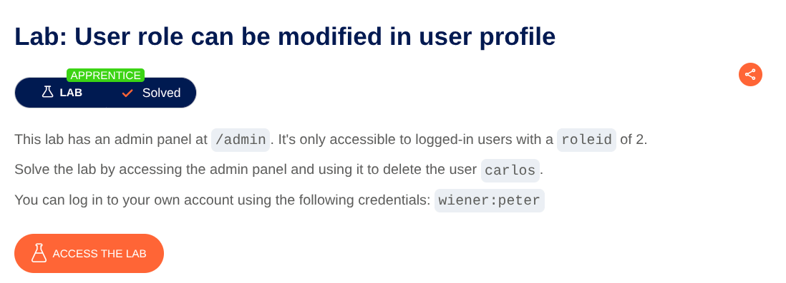
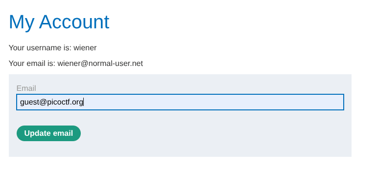
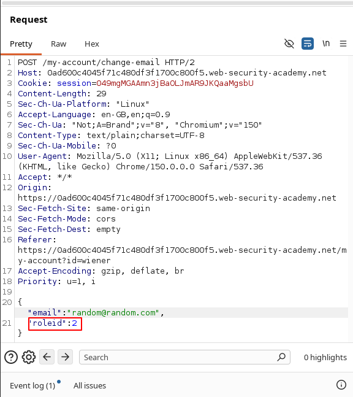
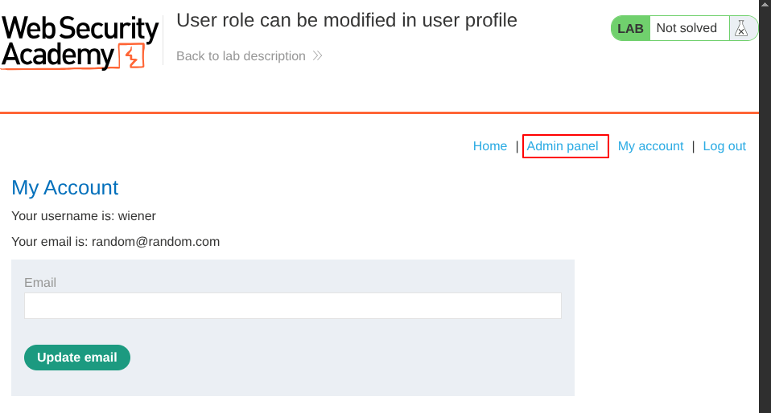

# User Role Can Be Modified in User Profile

**Lab:** Improper access control allowing a user to modify their `roleid` and gain unauthorized access to the admin panel.
**Category:** Access Control
**Difficulty:** Apprentice

To solve this lab we have to gain admin access and delete the user `carlos` . Given that the user with `roeid : 2`  can access the admin panel.
Open the website in burp's browser and login using given credentials `wiener:peter` .
Now turn your intercept on and change the emailid :

Click on update email and Intercept the request.
Now in the `POST` request add another `key:value` parameter `roleid:2` :
 

Now send the request. Then you will get admin panel option in your account page :

Go to admin panel and delete the user `carlos` , And the lab is solved.
