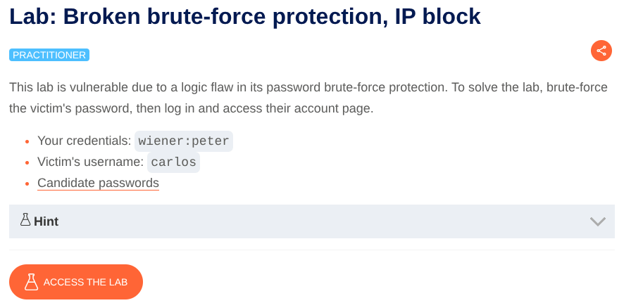
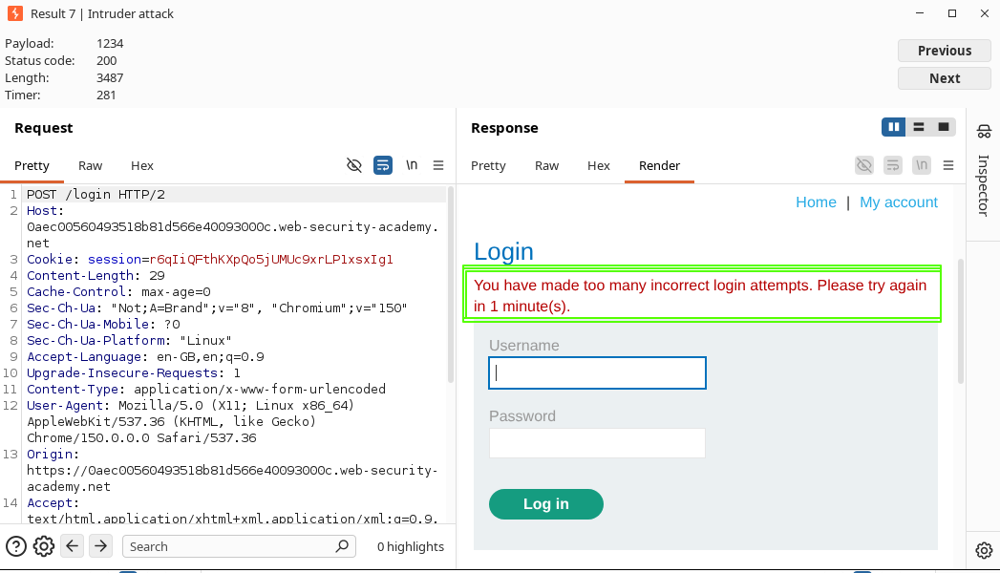
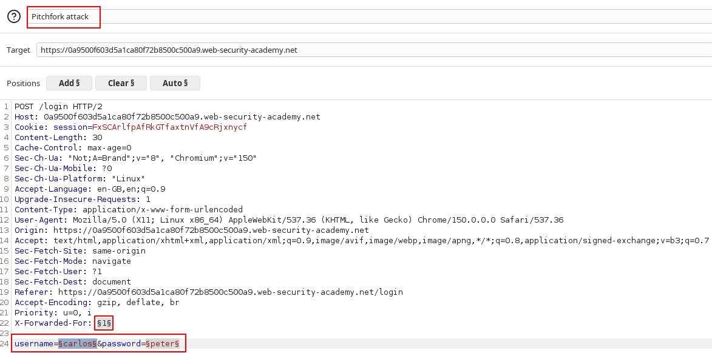
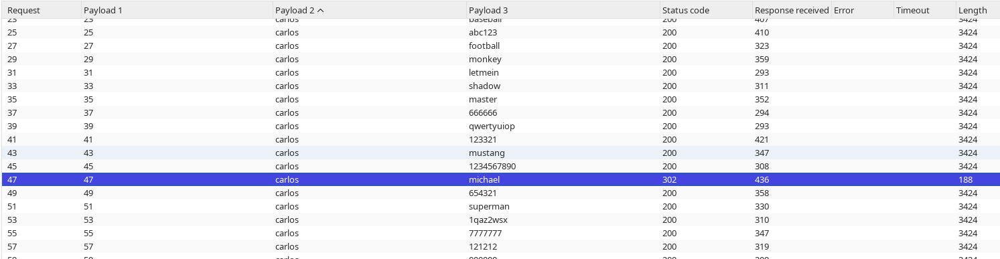

# Broken Brute-Force Protection via IP Block

**Lab:** A logic flaw in the brute-force protection allows attackers to reset the failed-login counter and bypass the protection to brute-force a user's password.

**Category:** Authentication — Brute-Force Attacks

**Difficulty:** Practitioner



In this lab, we are given the credentials `wiener:peter`. We have to log in as `carlos`.

We have to brute-force the victim's password. However, the website blocks the IP address if we make too many incorrect login attempts consecutively. It displays the following message:

`You have made too many incorrect attempts. Please try again in 1 minute(s).`



### Solution

First, we open the lab in Burp's browser and turn Intercept on. Then, we log in using `wiener:peter` and intercept the `POST` request.

Now, as we have to craft an attack, we send this request to Intruder.

## NOTE

I recommend reading the **Attack Configuration** and **Payload Explanation** sections before starting the attack.

#### Attack Configuration

1. Add `$$` to the username and password parameters.
    
2. Set the attack type to **Pitchfork attack**.
    


3. Configure the first payload for the **username** field.
    
    To bypass the brute-force protection, we have to log in successfully as `wiener` frequently. Therefore, the username payload alternates between `carlos` and `wiener`.
    
    The number of usernames must be the same as the number of passwords. You can create this payload using the Python script provided at the end of the solution.
    
    Enter it as:
    

```text
carlos
wiener
carlos
wiener
```

4. Now configure the main **password** payload.
    
    The password list is provided on the PortSwigger website. Since we have to frequently log in as `wiener`, we insert the password `peter` after every candidate password in the list.
    
    You can create this payload using the Python script provided at the end of the solution.
    
    Enter it as:
    

```text
123456
peter
password
peter
12345678
peter
```

5. Now start the attack.
    

#### Payload Explanation

You can visualize the payloads as follows:

|Username|Password|
|---|---|
|carlos|123456|
|wiener|peter|
|carlos|password|
|wiener|peter|
|carlos|12345678|
|wiener|peter|

##### For the first request:

We send the username `carlos` with the candidate password `123456`. The login fails, resulting in an `invalid username or password` message.

##### For the second request:

We send the username `wiener` with the password `peter`. The login is successful and the server returns a `302 Found` response.

##### For the third request:

We send the username `carlos` with the next candidate password, `password`. The login fails again.

This pattern continues throughout the attack:

```text
carlos → candidate password → failed login
wiener  → peter              → successful login
carlos → candidate password → failed login
wiener  → peter              → successful login
...
```

The important part is that the successful login as `wiener` resets the failed-login counter. Therefore, after each unsuccessful attempt against `carlos`, we successfully log in as `wiener`, preventing the brute-force protection from reaching its blocking threshold.



Now, look at the attack results. Sort the results by the **username** payload so that the requests for `carlos` are grouped together.

Find the request that received a `302 Found` response. The candidate password used in that request is the password for `carlos`.

Now, go back to the lab and log in using the discovered credentials.

Hence, the lab is solved.

## Python Scripts for Payloads

#### Script for Password Payload

Save the password list provided by PortSwigger in a file named `passwords.txt`, then run the following code:

```python
input_file = "passwords.txt"
output_file = "output.txt"

with open(input_file, "r") as f:
    passwords = f.read().splitlines()

with open(output_file, "w") as f:
    for password in passwords:
        f.write(password + "\n")
        f.write("peter\n")
```

This adds `peter` after every candidate password.

#### Script for Username Payload

Set `n` to the number of candidate passwords in your password list:

```python
n = 100  # Number of candidate passwords

for _ in range(n):
    print("carlos")
    print("wiener")
```

This generates the alternating username payload:

```text
carlos
wiener
carlos
wiener
...
```

The resulting username payload contains twice as many lines as the value of `n`, matching the password payload generated by the first script.