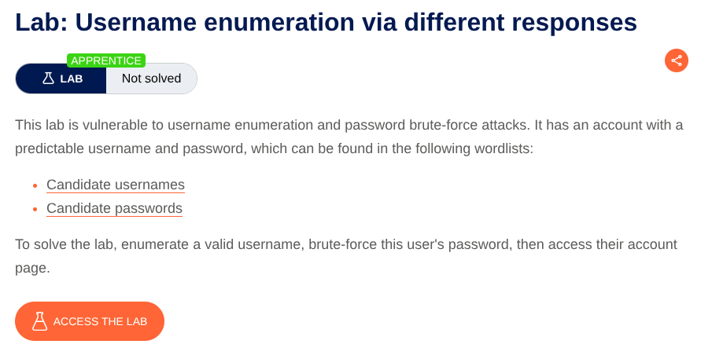
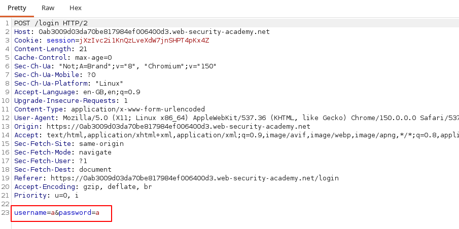
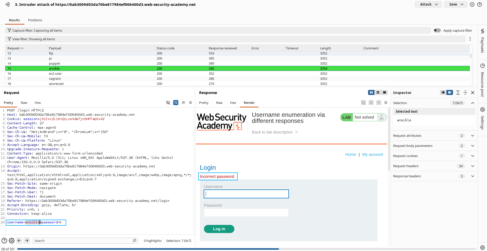
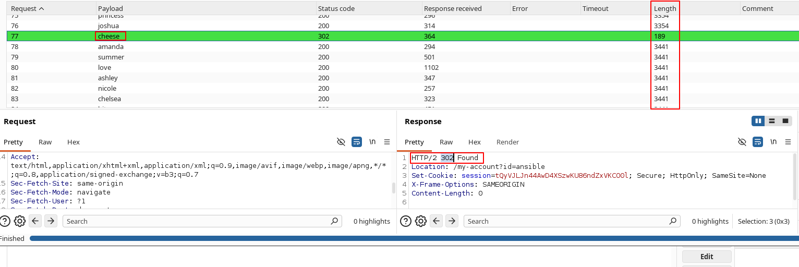

# Username Enumeration via Different Responses

**Lab:** Improper authentication response handling allowing attackers to enumerate valid usernames and subsequently brute-force their passwords.
**Category:** Authentication
**Difficulty:** Apprentice

In this lab we have to brute-force both username and password using the wordlist given in the lab.
We have to open the lab in burp's browser and then open the login page.
Turn the intercept on.
Then enter any random username and password and click login.
Now look at the request, It has a field `username=a&password=a`:

Now send this request to intruder.
#### Attack Configuration :
1) Select sniper attack. 
2) Add `$$` at the position of username first.
3) Select payload type as simple list.
4) In the payload paste the given payload.
5) Now start the attack.
6) Look for a response with different length.
7) Now See that it doesn't tell us `Invalid username` . Rather, it tells us `invalid password` . Which means the username is correct.
   

8) Now use the username in the second attack. In username enter the username you found and remove `$$` .
9) Add `$$` in the password field.
10) Keep all the things same and in payload paste the password list given in website.
11) Again send the request and look for a different `status code/length` .
12) Click on it and see it doesn't say `invalid username` or `invalid password`

So we have found the username and password to login. Use these credentials to login and your lab will be solved.
### Why we choose sniper attack 2 times rather than cluster bomb attack 1 time?
=> As the wordlists have 101 word in each so if we try to do cluster bomb attack ( Trying to bruteforce the username and password at once.) Then there will be total 1110 requests which will take too much time. So we will first bruteforce the username and then using the username we will bruteforce the password. It will generate 110+110 = 220 requests which is comparatively faster. so we choose sniper attack 2 times rather than cluster bomb attack 1 time
