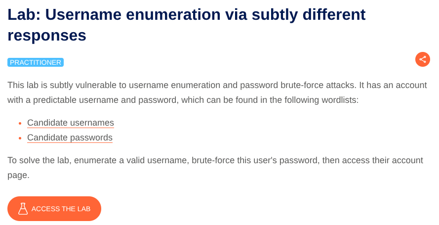
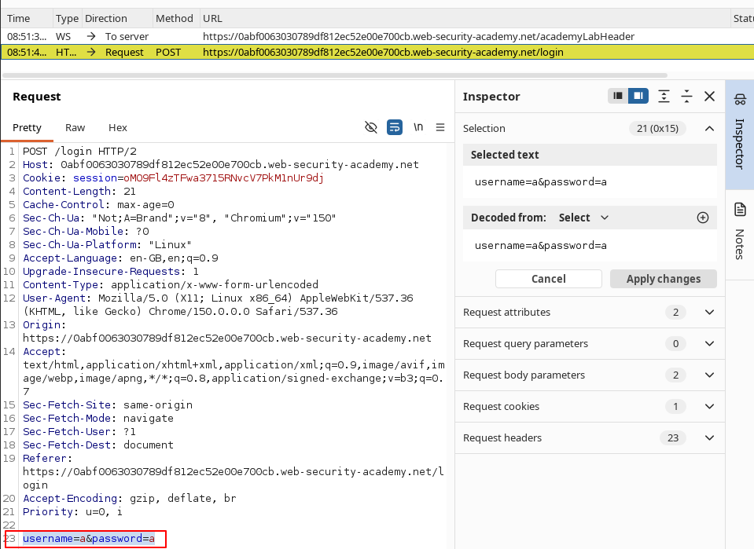
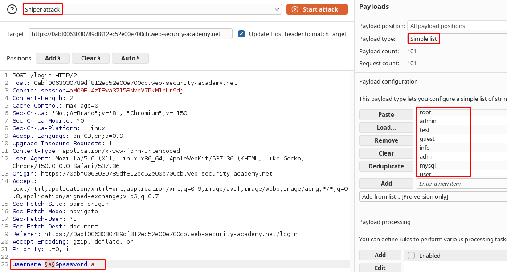
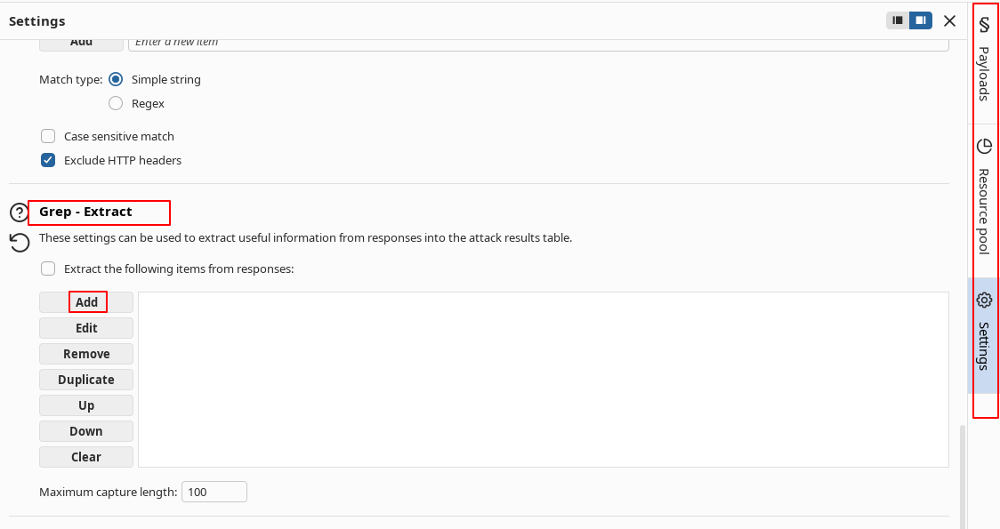
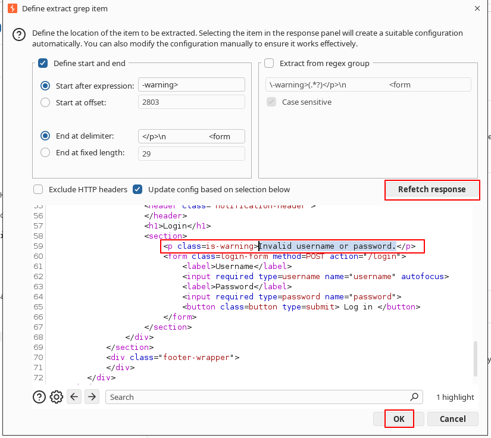
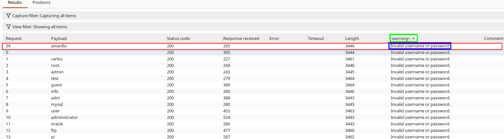
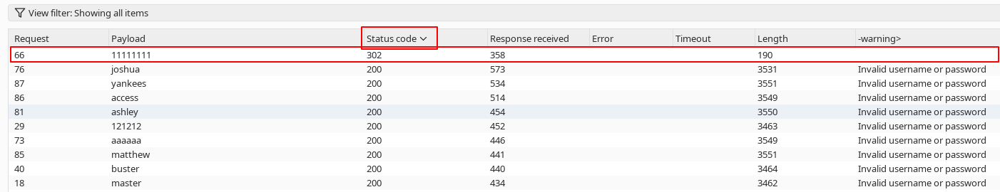

# Username Enumeration via Subtly Different Responses

**Lab:** Subtle differences in authentication responses enable username enumeration and facilitate targeted password brute-force attacks.
**Category:** Authentication — Username Enumeration
**Difficulty:** Practitioner

To solve this lab we have to find a valid user credentials and login to their account.
Open the website in burps browser and turn intercept on. Go to the login  page and try to login using any credentials. Now we intercept this request and send it to intruder.

Now we have to craft an attack to brute-force the password.
#### Attack Configuration :
1) Select sniper attack. 
2) Add `$$` at the position of username first.
3) Select payload type as simple list.
4) In the payload paste the given payload.
5) Click on the  **Settings** tab to open the **Settings** side panel. Under **Grep - Extract**, click **Add**. In the dialog that appears, scroll down through the response until you find the error message `Invalid username or password.`. Use the mouse to highlight the text content of the message. The other settings will be automatically adjusted. Click **OK** and then start the attack. (This will add a mew column  `-warning>` to the attack response page where you can see the highlighted part.)
   
   
   
   
   
   

6) Now start the attack.
7) Click on `-warning>` it will reorder the responses and you will get a response at the top which is different from others. Look closer at this response and notice that it contains a typo in the error message - instead of a full stop/period, there is a trailing space. Make a note of this username.

8) Now go to the intruder page and replace the username with this username. Then place `$$`  in password field. For the payload paste the given password list. And repeat the same attack.
9) Look for a response with status code 302(redirection)
   
   
   
10) The password here is the correct password corresponding to the given username.
Now you have found the username and password. Login using these and your lab will be solved.