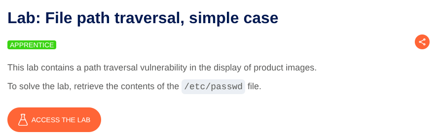
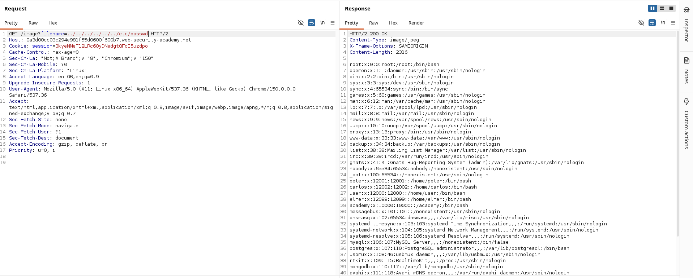

# File Path Traversal in Product Image Retrieval

**Lab:** Exploiting a path traversal vulnerability in image file retrieval allows unauthorized access to sensitive files on the server.

**Category:** File Path Traversal

**Difficulty:** Apprentice

  

To solve this lab, we have to retrieve the contents of `/etc/passwd`.

First, we need to find an endpoint that uses a filename or path to retrieve a file. Click **View details** for any product and open the product image in a new tab. You will see that the image is retrieved using an endpoint similar to:

```
/image?filename=15.jpg
```

Intercept this request in Burp Suite and send it to **Repeater**, where we can modify the `filename` parameter.

  

First, replace the filename with the absolute path:

```
/etc/passwd
```

Send the request and check whether the application accepts absolute paths.

If the absolute path does not work, try using relative path traversal. Add multiple `../` sequences before the target file:

```
../../../../etc/passwd
```

The `../` sequences move up through the parent directories until reaching the filesystem root. After using enough traversal sequences, the application returns the contents of `/etc/passwd`.

  

Hence, the lab is solved.