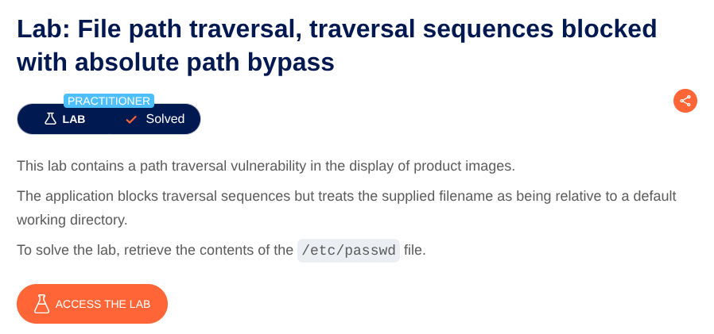
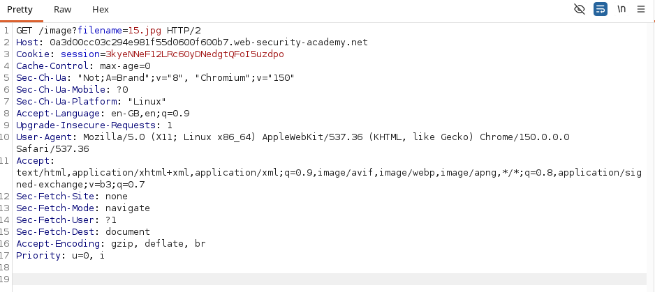
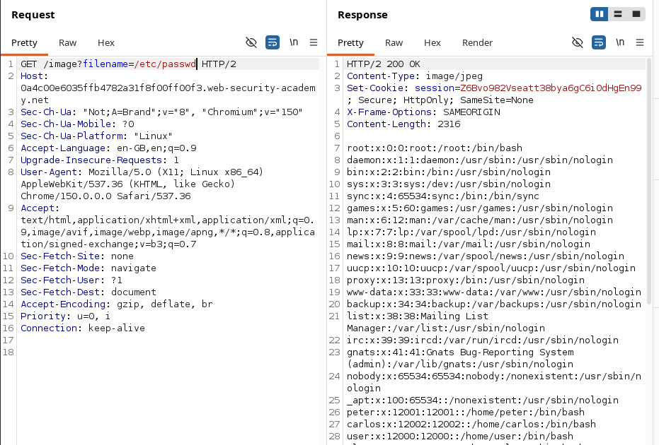

# File Path Traversal via Absolute Path Bypass

**Lab:** Exploiting unrestricted absolute file paths in a file retrieval parameter allows unauthorized access to sensitive files outside the intended directory.

**Category:** File Path Traversal

**Difficulty:** Practitioner

The goal of this lab is to retrieve the contents of `/etc/passwd`.


## Identifying the Vulnerable Endpoint

First, we need to find an endpoint that uses a user-controlled filename to retrieve a file.

Click **View details** on any product and open its image in a new tab. The image is loaded through an endpoint similar to:

```
/image?filename=15.jpg
```

Here, the `filename` parameter determines which file the application tries to retrieve.

To test whether this parameter is vulnerable, intercept the request in **Burp Suite** and send it to **Repeater**. This allows us to modify the `filename` value and observe how the application responds.


## Exploiting the Absolute Path

The application normally expects a filename such as:

```
15.jpg
```

Instead, we can try providing the absolute path of a file on the server:

```
/etc/passwd
```

The request becomes:

```
/image?filename=/etc/passwd
```

Send the request from **Burp Suite Repeater**.

The application accepts the absolute path and responds with the contents of `/etc/passwd`.

This confirms that the application is not properly restricting the `filename` parameter to the intended directory and is allowing us to request files using their absolute paths.


## Conclusion

The vulnerability exists because the application trusts the user-supplied `filename` parameter without properly validating where the requested file is located.

By providing an absolute path such as:

```
/etc/passwd
```

we can make the application retrieve a file outside its intended directory.

The lab is therefore solved.