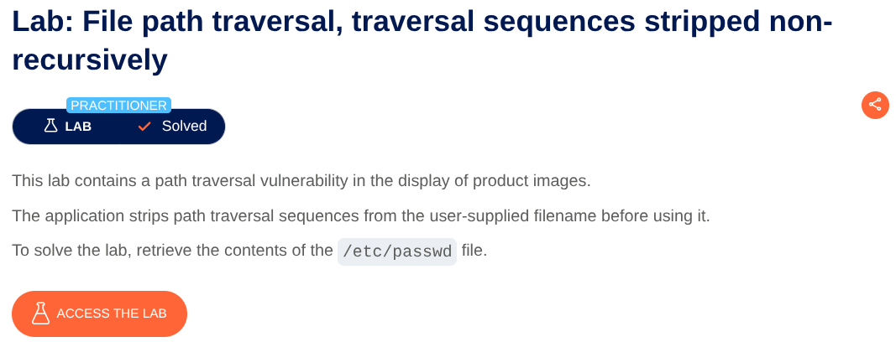
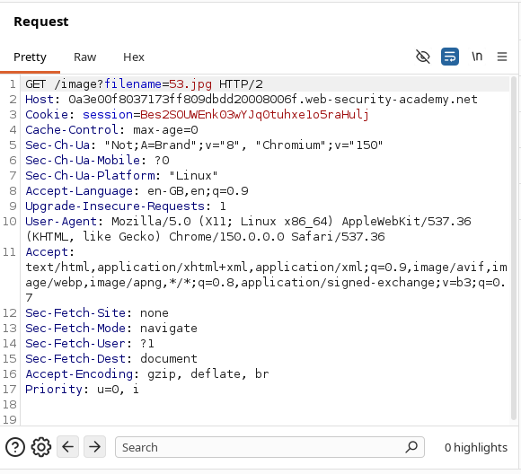
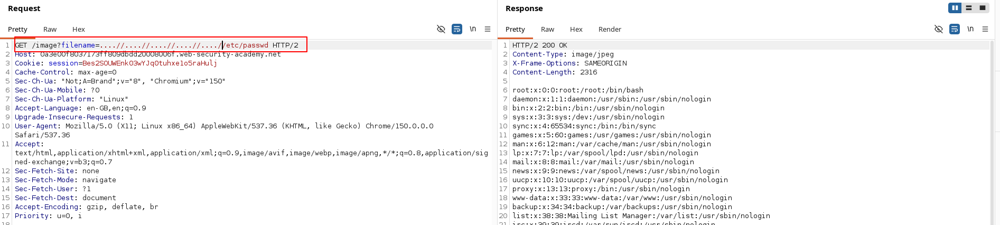

# File Path Traversal via Non-Recursive Traversal Sequence Stripping

**Lab:** Exploiting non-recursive removal of path traversal sequences allows crafted input to bypass filtering and access sensitive files.

**Category:** File Path Traversal

**Difficulty:** Practitioner


The objective of this lab is to retrieve the contents of `/etc/passwd`.
## Identifying the Vulnerable Endpoint

First, we need to identify an endpoint that accepts a filename or path and uses it to retrieve a file.

Click **View details** on any product and open the product image in a new tab. The image is loaded through an endpoint similar to:

```text
/image?filename=53.jpg
```

This indicates that the `filename` parameter may be controlling which file the server attempts to retrieve.

Intercept the request using **Burp Suite** and send it to **Repeater** so that we can modify the `filename` parameter.


## Testing Path Traversal

We can first test some common path traversal payloads:

```text
../../../../etc/passwd
```

An absolute path can also be tested:

```text
/etc/passwd
```

We can also try URL-encoded traversal sequences:

```text
%2e%2e%2f%2e%2e%2fetc/passwd
```

However, these payloads do not work because the application filters path traversal sequences such as:

```text
../
```

The lab specifically states that the application removes traversal sequences from the user-supplied filename.

## Bypassing the Filter

The important detail is that the filtering is **non-recursive**.

Instead of directly using:

```text
../
```

we can place another `..` in front of the traversal sequence:

```text
....//
```

Consider the following payload:

```text
....//....//....//etc/passwd
```

Each `....//` contains an embedded `../` sequence.

Conceptually, the server receives:

```text
....//....//....//etc/passwd
```

and removes the first occurrence of `../` from each sequence.

For example:

```text
....//
```

becomes:

```text
../
```

The important part is that the application performs the replacement only once. It does not repeatedly inspect the resulting string for another traversal sequence.

Therefore:

```text
....//....//....//etc/passwd
```

is transformed into something equivalent to:

```text
../../../etc/passwd
```

The resulting path traversal is then interpreted by the server, allowing us to access:

```text
/etc/passwd
```


## Conclusion

The vulnerability exists because the application attempts to prevent path traversal by removing `../` sequences instead of properly validating and canonicalizing the requested path.

Because the filtering is **non-recursive**, specially crafted input such as:

```text
....//....//....//etc/passwd
```

can be transformed into valid traversal sequences after the filtering step.

This demonstrates why simple string replacement is not a reliable defense against path traversal vulnerabilities.