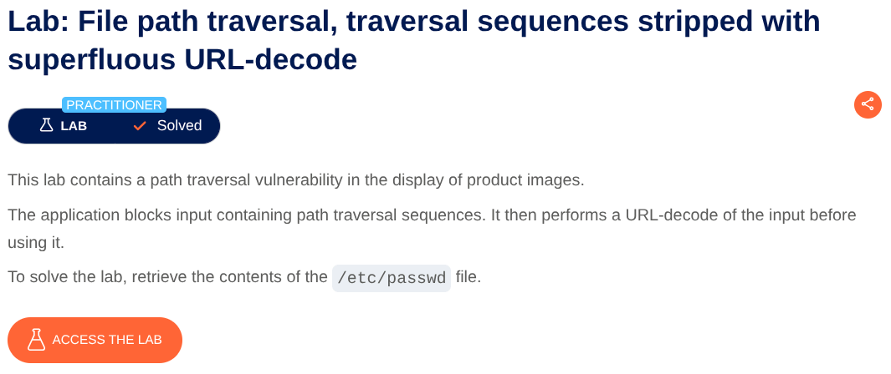
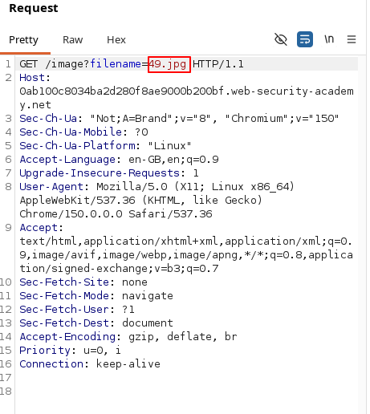
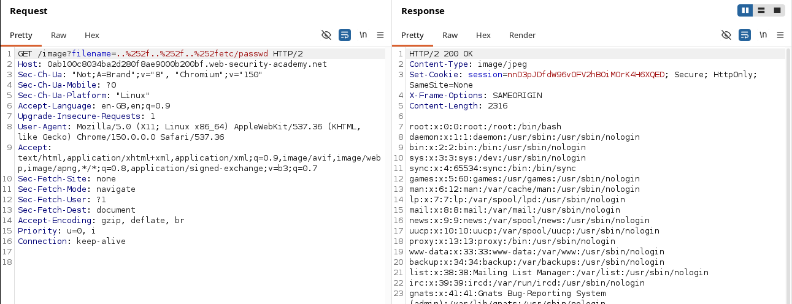

# File Path Traversal, Traversal Sequences Stripped with Superfluous URL-Decode

**Lab:** Exploiting a superfluous URL-decoding step allows double-encoded path traversal sequences to bypass input filtering and access sensitive files.

**Category:** File Path Traversal

**Difficulty:** Practitioner



The goal of this lab is to retrieve the contents of `/etc/passwd`.

## Identifying the Vulnerable Endpoint

First, we need to find an endpoint that accepts a filename or path and uses it to retrieve a file.

Click **View details** on any product and open the product image in a new tab. The image is loaded through an endpoint similar to:

```text
/image?filename=49.jpg
```

The `filename` parameter appears to control which file the application retrieves.

Intercept this request using **Burp Suite** and send it to **Repeater** so that we can modify the `filename` parameter and observe how the application handles different inputs.


## Testing Path Traversal

We can start by testing a few common path traversal payloads.

First, try a relative path:

```text
../../../../etc/passwd
```

We can also try an absolute path:

```text
/etc/passwd
```

Another common filter bypass is to use a malformed-looking traversal sequence such as:

```text
....//....//....//etc/passwd
```

However, these payloads do not work.

The lab description gives us an important clue: the application **blocks traversal sequences and then URL-decodes the input before using it**.

This suggests that there may be a way to make the traversal sequence appear harmless during the filtering stage and only turn into `../` afterward.

## Understanding the URL Decoding

Before trying a double-encoded payload, it helps to understand how URL encoding works.

The normal URL-encoded representation of:

```text
../
```

is:

```text
%2e%2e%2f
```

If we send this directly, the application can decode it before applying its filtering logic, allowing it to detect the resulting `../` sequence.

So instead, we can **encode the `%` characters themselves**.

For example:

```text
%252e%252e%252f
```

Here:

```text
%25
```

represents the `%` character.

Therefore:

```text
%252e
```

is decoded once to:

```text
%2e
```

and then decoded again to:

```text
.
```

Likewise:

```text
%252f
```

becomes:

```text
%2f
```

and then:

```text
/
```

So after two URL-decoding operations:

```text
%252e%252e%252f
```

eventually becomes:

```text
../
```

## Bypassing the Filter

We can now construct the full payload by double-encoding each traversal sequence:

```text
%252e%252e%252f%252e%252e%252f%252e%252e%252fetc/passwd
```

The important part is that the payload does **not initially contain the literal `../` sequence**. After the first decoding stage, it becomes:

```text
%2e%2e%2f%2e%2e%2f%2e%2e%2fetc/passwd
```

At this stage, the application can perform its traversal-sequence filtering without seeing the literal `../`.

The application then performs another URL-decode before using the resulting path. The encoded sequences are decoded again:

```text
%2e%2e%2f
```

becomes:

```text
../
```

So the final path is effectively:

```text
../../../etc/passwd
```

The application then processes the resulting traversal path and returns the contents of:

```text
/etc/passwd
```

The lab is therefore solved.


## Conclusion

The vulnerability exists because the application performs URL decoding more than once while relying on filtering to prevent path traversal.

By double-encoding the traversal characters, we can prevent the dangerous sequence from being recognized during the filtering stage. The second URL-decoding operation then converts the encoded input back into a valid traversal sequence.

The key idea is:

```text
%252e%252e%252f
        ↓ first decode
%2e%2e%2f
        ↓ second decode
../
```

This demonstrates why security filtering should be performed on a properly canonicalized representation of the input, rather than relying on simple string matching before additional decoding takes place.