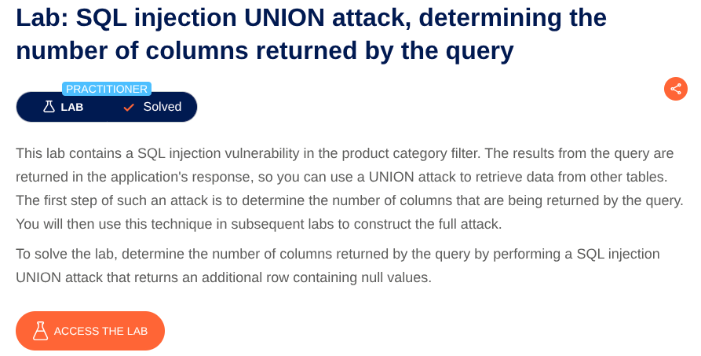

# SQL Injection in Product Category Filter
**Lab:** SQL injection vulnerability in product category filter allowing retrieval of number of columns and an additional row containing null values.
**Category:** SQL Injection
**Difficulty:** Practitioner



Now to complete the lab we have to perform a SQL injection attack that causes the application to show number of columns and an additional row containing null values..

Now see the URL there is a filter : `/filter?category=Gifts`
Put a `'`  and see that it says internal server error. Adding a single quote causes an internal server error, indicating that the input is being incorporated into a database query and that the quote is affecting the query syntax.

Determine the number of columns that are being returned by the query.

Now Add the payload at the end of the URL :
```'+UNION+SELECT+NULL+FROM+dual--```

```'+UNION+SELECT+NULL,NULL+FROM+dual--```

```'+UNION+SELECT+NULL,NULL+NULL+FROM+dual--```

After you try with 3 NULLs it says Lab completed which means there was 3 rows