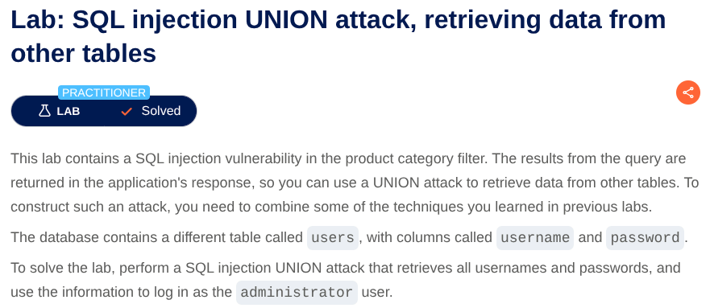

# SQL Injection in Product Category Filter
**Lab:** SQL injection vulnerability in login function allowing  to login as any user along with Administrator **Category:** SQL Injection
**Difficulty:** Apprentice



Now to complete the lab we have to perform a SQL injection attack that causes the application to show username and passwords of users.

Now see the URL there is a filter : `/filter?category=Gifts`
Put a `'`  and see that it says internal server error. Adding a single quote causes an internal server error, indicating that the input is being incorporated into a database query and that the quote is affecting the query syntax.

Determine the number of columns that are being returned by the query.

Now Add the payload at the end of the URL :
```'+UNION+SELECT+NULL--```

```'+UNION+SELECT+NULL,NULL--```

Then try this to determine which columns contain text data:

```'+UNION+SELECT+'abc',NULL--```
```'+UNION+SELECT+'abc','abc'--```

Now as from the problem we know there is a table named users with columns username and password, So we will construct payload to retrieve that data :


```'+UNION+SELECT+username,+password+FROM+users--```


Thus you got the usernames and password and use that credential to login. Hence the lab is solved.