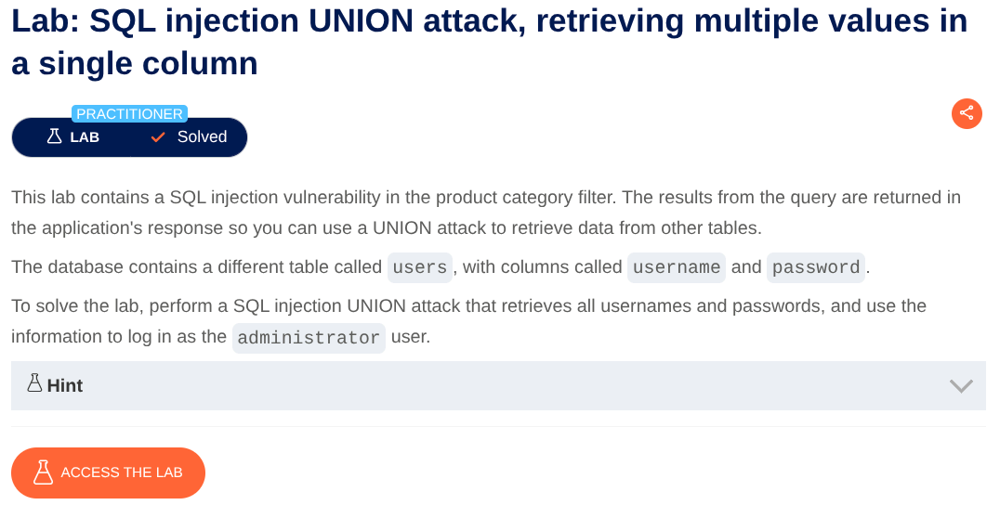
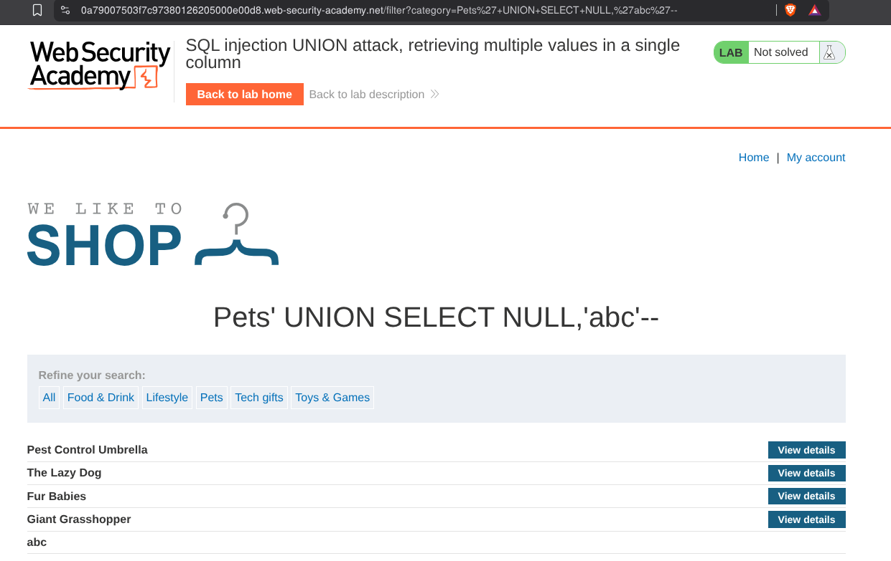
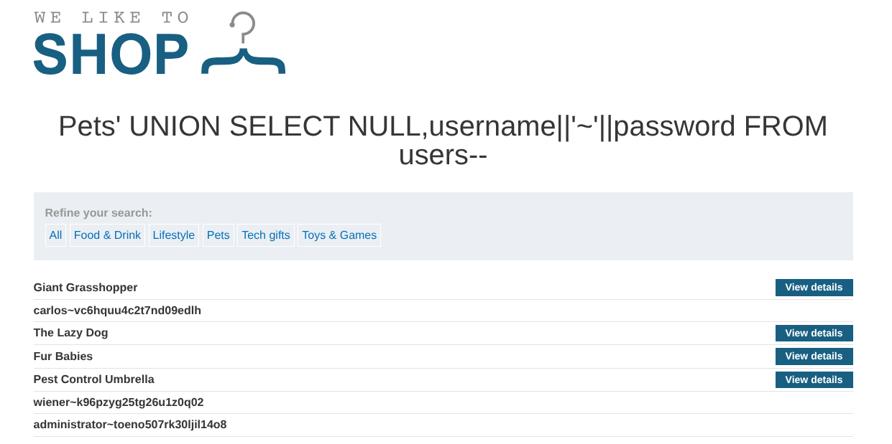

# SQL Injection UNION Attack: Retrieving Multiple Values in a Single Column

**Lab:** SQL injection vulnerability allowing multiple values from the `users` table to be combined into a single column and retrieved through a `UNION` query.

**Category:** SQL Injection

**Difficulty:** Practitioner



The application provides a product category filter. Selecting a category causes the application to send the selected value through the `category` parameter. Go to any product category.

Now to complete the lab we have to perform a SQL injection attack that causes the application to display database version string.
Now see the URL there is a filter : `/filter?category=Gifts`
Put a `'`  and see that it says internal server error. Adding a single quote causes an internal server error, indicating that the input is being incorporated into a database query and that the quote is affecting the query syntax.

Determine the number of columns that are being returned by the query.
Now Add the payload at the end of the URL :
```'+UNION+SELECT+NULL--```

```'+UNION+SELECT+NULL,NULL--```
until you found the number of columns. Then try this to determine which columns contain text data:

```'+UNION+SELECT+'abc',NULL--```
```'+UNION+SELECT+'abc','abc'--```



Now use this payload to see the usernames and passwords:
`'+UNION+SELECT+NULL,username||'~'||password+FROM+users--`



Now login using the Administrator credentials and the lab is solved.
