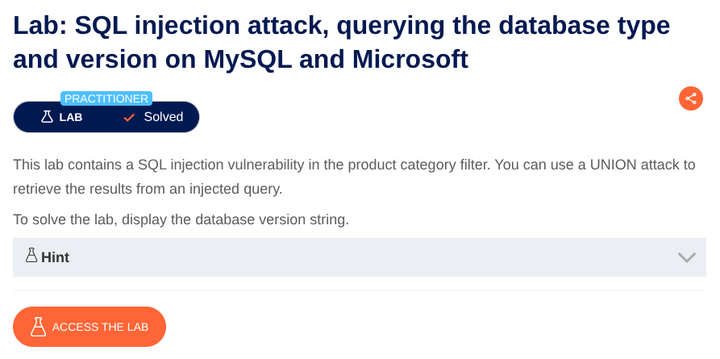
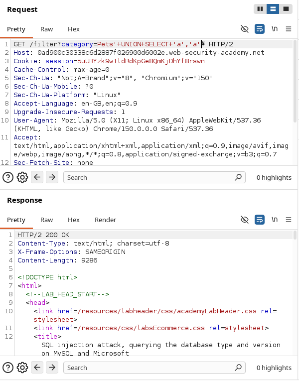
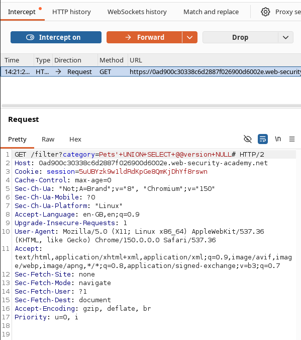

# SQL Injection in Product Category Filter
**Lab:** SQL injection vulnerability in product category filter allowing retrieval of the database version string.
**Category:** SQL Injection
**Difficulty:** Practitioner



The application provides a product category filter. Selecting a category causes the application to send the selected value through the `category` parameter. Go to any product category.

Now to complete the lab we have to perform a SQL injection attack that causes the application to display database version string.
Now see the URL there is a filter : `/filter?category=Gifts`
Put a `'`  and see that it says internal server error. Adding a single quote causes an internal server error, indicating that the input is being incorporated into a database query and that the quote is affecting the query syntax.
Now open this website using burps browser then refresh the page while staying in a category. Now intercept the request.

Determine the number of columns that are being returned by the query and which columns contain text data.
As its a non Oracle system so we don't need to add ``FROM``

Now Add the payload at the end of the URL :
```'+UNION+SELECT+NULL#```
..
```'+UNION+SELECT+NULL,NULL#```


until you found the number of columns. Then try this to determine which columns contain text data:

```'+UNION+SELECT+'abc',NULL#```
```'+UNION+SELECT+'abc','abc'#```



After you determine this then  construct the payload :
```'+UNION+SELECT+@@version,+NULL#```



#### Breakdown of payloads:

| Component   | Purpose                                                                                                 |
| ----------- | ------------------------------------------------------------------------------------------------------- |
| `'`         | Attempts to terminate the existing string literal                                                       |
| `UNION`     | Combines the results of the original query with the results of an additional `SELECT` query             |
| `SELECT`    | Specifies the values or columns to retrieve in the injected query                                       |
| `NULL`      | Provides a placeholder value while determining the required number of columns and compatible data types |
| `abc`       | A test string/value used to determine whether a particular column accepts string data                   |
| `#`         | Begins a comment in MySQL, causing the remainder of the SQL statement to be ignored                     |
| `@@version` | MySQL system variable that returns the database server's version information                            |
## Key Takeaways

- User-controlled input in the `category` parameter was incorporated into a SQL query without sufficient protection.
- A single quote (`'`) can be used to test whether user input is affecting the SQL query syntax.
- `UNION SELECT` can be used to append the results of a second query to the original query.
- The number of columns returned by the original query must match the number of columns in the injected `UNION SELECT`.
- `NULL` values can be used to determine the required column count and avoid data-type incompatibilities during testing.
- Test strings such as `abc` can help identify which returned columns accept text data.
- In MySQL, `@@version` can be used to retrieve the database server's version information.
- SQL injection can expose sensitive database information when user input is improperly incorporated into SQL queries.
- **Parameterized queries / prepared statements** are the primary defense against SQL injection.
## Lab Completed 
The application successfully let us login as an Administrator, completing the lab.