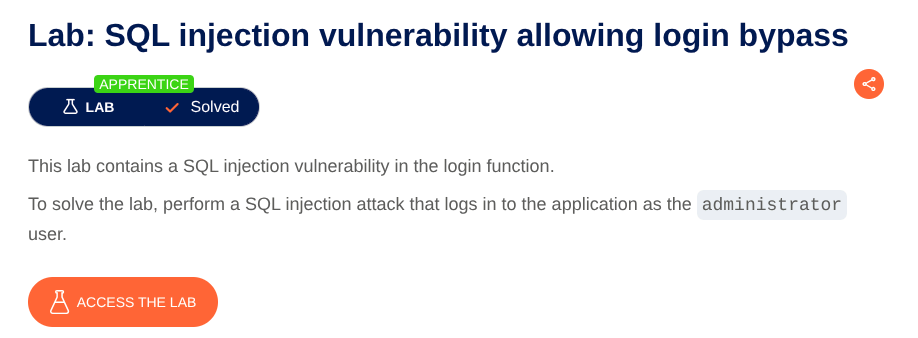
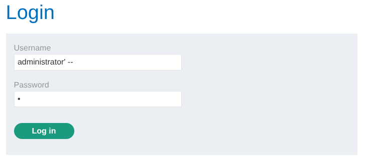

# SQL Injection in Product Category Filter
**Lab:** SQL injection vulnerability in login function allowing  to login as any user along with Administrator **Category:** SQL Injection
**Difficulty:** Apprentice



In the lab go to user login page.
In the username field if we enter Administrator' then it says internal server error.  Adding a single quote causes an internal server error, indicating that the input is being incorporated into a database query and that the quote is affecting the query syntax.

In database its running a query like :
```SELECT * FROM users WHERE user='' AND password=''```

Now add ```' --``` at the end of username. 

| Component | Purpose                                           |
| --------- | ------------------------------------------------- |
| `'`       | Attempts to terminate the existing string literal |
| `--`      | Comments out the remainder of the SQL statement   |
Now the Query becomes :

```
SELECT * FROM users WHERE user='Administrator'--' AND password='1'
```

which means ```SELECT * FROM users WHERE user='Administrator'```



That's why it's not checking the password anymore and letting us login as Administrator.
## Key Takeaways

- User-controlled input was incorporated into a SQL query.
- A single quote caused a change in SQL parsing behavior.
- SQL comments can be used to neutralize the remainder of a query.
## Lab Completed 
The application successfully let us login as an Administrator, completing the lab.