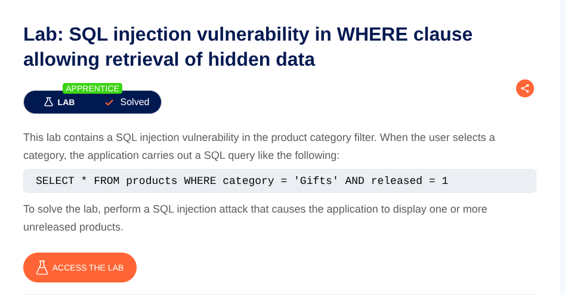
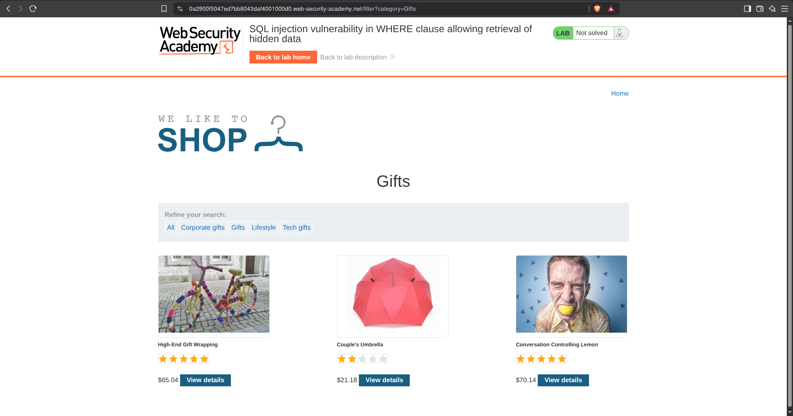
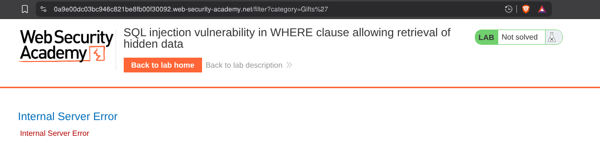
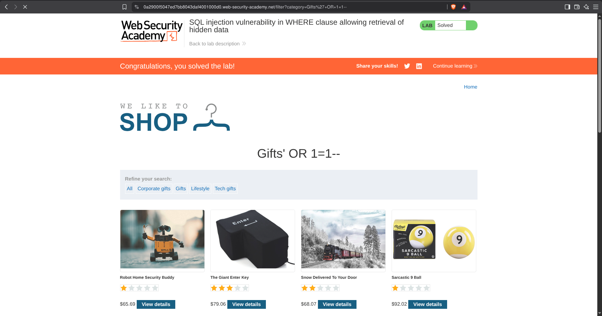

# SQL Injection in Product Category Filter
**Lab:** SQL injection vulnerability in product category filter allowing retrieval of unreleased products. **Category:** SQL Injection
**Difficulty:** Apprentice

The application provides a product category filter. Selecting a category causes the application to send the selected value through the `category` parameter. Go to any product catagory.

Now to complete the lab we have to perform a SQL injection attack that causes the application to display one or more unreleased products.

Now see the URL there is a filter : `/filter?category=Gifts`
Put a `'`  and see that it says internal server error. Adding a single quote causes an internal server error, indicating that the input is being incorporated into a database query and that the quote is affecting the query syntax.

Now add `'+OR+1=1--` at the end of the URL .

| Component | Purpose |
|---|---|
| `'` | Attempts to terminate the existing string literal |
| `OR` | Introduces an alternative Boolean condition |
| `1=1` | Creates a condition that always evaluates to true |
| `--` | Comments out the remainder of the SQL statement |

As 1=1 is always true so it will show all the results and as the condition check after it, is commented by -- so no other condition after it will be check.
Because `1=1` is always true, the injected condition causes the query's filtering condition to evaluate as true for the returned rows. The remainder of the original query is commented out, allowing the application to return products that were previously excluded by the intended filter.

## Key Takeaways

- User-controlled input was incorporated into a SQL query.
- A single quote caused a change in SQL parsing behavior.
- Boolean-based SQL injection can manipulate query conditions.
- SQL comments can be used to neutralize the remainder of a query.
- Parameterized queries are an important defense against SQL injection.
## Lab Completed 
The application successfully displayed the previously unreleased products, completing the lab.